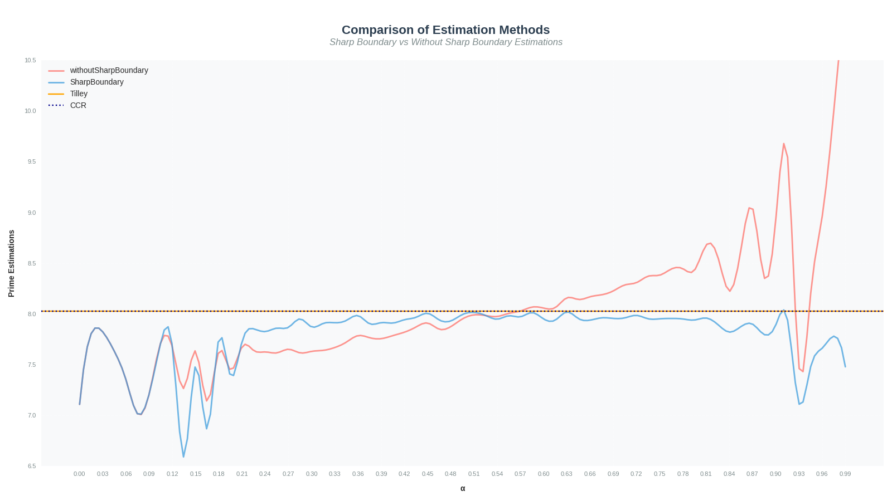
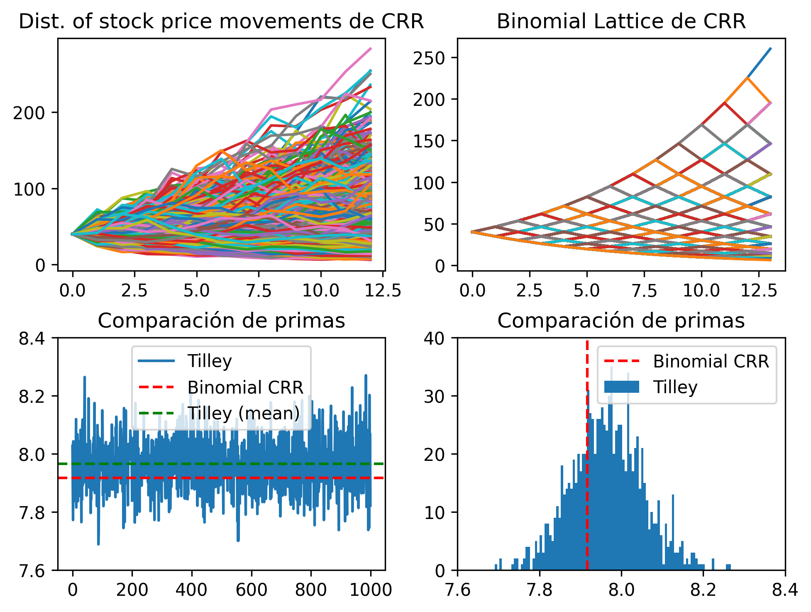

# Índice

- [Índice](#índice)
- [Introducción](#introducción)
- [Desarrollo](#desarrollo)
  - [Variables a considerar:](#variables-a-considerar)
  - [Estimador de la Prima](#estimador-de-la-prima)
  - [Algoritmo](#algoritmo)
  - [Análisis](#análisis)
- [Conclusiones](#conclusiones)
- [Bibliografía](#bibliografía)

# Introducción

El Método de Tilley es un método de **Monte Carlo** que utiliza una estrategia de agrupamiento de trayectorias, y puede ser utilizado para valorar opciones americanas como también opciones sobre multiactivos.

El algoritmo utiliza **muestreo estratificado** y un esquema de agrupamiento ("bundling") para estimar el valor de la opción a lo largo de múltiples trayectorias de precios simuladas. En particular, se enfoca en la **regla de ejercicio óptima** (momento óptimo para ejercer la opción) en cada paso del tiempo simulado.

# Desarrollo

## Variables a considerar:

- $t_i$ con $i \in \mathbb N_0$, donde $t_0$ es el tiempo de origen.
- $S(i)$ con $i \in \mathbb N_0$, que sería el precio del subyacente en el tiempo $i$.
- Se requiere una muestra finita de $R$ caminos.
- $S(0), S(k, 1), S(k, 2), \dots, S(k, N)$ es la secuencia del $k$-ésimo camino.
- $d(k, t)$ es el valor presente en tiempo $t$ del camino $k$ de un pago que ocurre en $t + 1$.
- $D(k, t)$ es el valor presente en tiempo $0$ de un pago en tiempo $t$ del camino $k$, calculado mediante el producto de los factores de descuento $d(k, s)$ desde $s= 0$ hasta $s= t - 1$.
- $X(i)$ con $i \in \mathbb N$, que sería el precio de ejercicio en tiempo $i$.
    
    > Por lo general es una constante.

- Valor intrínseco
    
$$
I(k, t) =  \begin{cases}
\max[0, S(k, t) - X(t)] & call \\
\max[0, X(t) - S(k, t)] & put
\end{cases} 
$$
    
- $z(k, t)$ booleano que indica si se ejerció la acción ($1$) o no ($0$) en el camino $k$ en tiempo $t$.
    - $z(k, t_*) = 1 \Longrightarrow z(k, t) = 0, \forall t \ne t_*$.

## Estimador de la Prima

Primero hay que calcular todos los $D(k, t)$ para luego poder hacer el promedio

$$
Premium\ Estimator = R^{-1} \sum_{k} \sum_{t} z(k, t) D(k, t) I(k, t)
$$

## Algoritmo

1. Reordenar las rutas de precios de las acciones por precio de las acciones, desde el precio más bajo hasta el precio más alto para una opción de compra o desde el precio más alto hasta el precio más bajo para una opción de venta. Reindexar las rutas de $1$ a $R$ según el reordenamiento.
2. Para cada ruta $k$, calcule el valor intrínseco $I(k, t)$ de la opción.
3. Dividir el conjunto de $R$ caminos ordenados en $Q$ distintos armados de $P$ caminos cada uno. Asignar los primeros $P$ caminos al primer haz, los segundos $P$ caminos al segundo haz, y así sucesivamente, y finalmente los últimos $P$ camino al $Q$-ésimo haz. 
    
    > Se supone que $P$ y $Q$ son factores enteros de $R$.

4. Para cada ruta $k$, el “valor de retención” de la opción $H(k, t)$ se calcula como la siguiente expectativa matemática tomada sobre todas las rutas en el paquete que contiene la ruta $k$:
    
$$
H(k, t) = d(k, t) P^{-1}  \sum_{j \in B_k} V(j, t + 1)
$$
    
    > $B_k$ es el armado que contiene el camino $k$.
    > $V(k, t)$ se define más adelante y se tiene $\forall k, V(k, N) = I(k, N)$.

5. Para cada ruta, compare el valor de retención $H(k, t)$ con el valor intrínseco $I(k, t)$ y decida “provisionalmente” si ejercer o mantener. 
    
    Defina una variable indicadora $x(b,t)$ de la siguiente manera:
    
$$
x(k, t) = \begin{cases}
1 &,& I(k, t) > H(k, t)  \\
0 &,& cc
\end{cases}
$$
    
    > Es un $z$ provisorio.

6. Examine la secuencia de $0$’s y $1$’s $\{x(k, t); k = 1,2..., R\}$. Determine un límite entre los `Hold` y el `Exercise` como el inicio de la primera cadena de $1$’s cuya longitud exceda la longitud de cada cadena posterior de $0$. Sea $k_*(t)$ el índice de ruta (en la muestra, tal como se ordenó en el subpaso $1$ anterior) del $1$ principal en dicha cadena. La “zona de transición” entre la espera y el ejercicio se define como la secuencia de $0$’s y $1$’s que comienza con el primer $1$ y termina con el último $0$.
7. Defina una nueva variable indicadora de ejercicio o retención $y(k, t)$ que incorpore el límite de la siguiente manera:
    
$$
y(k, t) = \begin{cases}
1 &,& k \ge k_*(t)  \\
0 &,& cc
\end{cases}
$$

    > Esta indicadora (junto con el paso 6) son la mejora de “transition zone” a “sharp boundary” pero no son estrictamente necesarios, pueden ser reemplazados por la indicadora x (con su respectivo decaimiento en la precisión).
    
8. Para cada camino $k$, se define el valor actual de $V(k, t)$ de la opción como:

$$
V(k, t) = \begin{cases}
I(k t) &,& y(k, t) = 1 \\
H(k t) &,& y(k, t) = 0
\end{cases}
$$

Luego de que el algoritmo ha sido procesado hacia atrás desde el tiempo $N$ hasta el tiempo $1$ (o tiempo $0$ si se permite el ejercicio inmediato), la variable indicadora $z(k, t)$ para $t < N$ se estima de la siguiente manera:

$$
z(k, t) = \begin{cases}
1 &,& y(k, t) = 1 \land y(k, s) = 0\ \forall s < t \\
0 &,& cc
\end{cases}
$$

## Análisis
La elección de los $P$ y $Q$ si bien es arbitraría, las fórmulas $P = R^{a}$ y $Q = R^{1 - a}$ presentan al elemento  que es relevante en la precisión del algoritmo y su fijación sumada a $R \to \infty$, deriva en que la estimación de la prima converja a su valor real. 

El siguiente gráfico muestra la cercanía del método de Tilley al valor real (línea punteada) para sus implementaciones “transition zone” (línea roja) y “sharp boundary” (línea azul) para distintos:

Por otro lado, se realizaron pruebas siguiendo ciertas limitaciones paramétricas para facilitar la comparación. Por un lado se estimó la prima utilizando el Binomial Lattice de Cox y Rubinstein (método preciso pero limitado) y por el otro, y empleando los mismos parámetros, se estimó la prima utilizando Tilley y una muestra aleatoria generada por “continuous distribution of stock prices” descrita en el paper de CRR y recomendada por Tilley en sus casos de prueba. Éstas pruebas arrojaron resultados de primas $8.027317961052654$ y $7.917012092274746$ para Tilley y CRR respectivamente, con tiempos $0.06888055801391602$ y $0.04132819175720215$.

# Conclusiones

Si bien el algoritmo de Tilley no es el más eficiente (hemos tenido pruebas 3 veces más lentas que el de CRR), puede partir de condiciones desconocidas y muestras caóticas tal y como se muestra en el gráfico dado y con un margen de error relativamente pequeño, además, se demuestra en el paper que para muestras con un $R$ lo suficientemente grande, Tilley tiende al valor real gracias a su factor de regresión. Sumado a todo ésto, Tilley tiene funciones computacionalmente densas como son el paso 1 y 6, que son fácilmente paralelizables, al igual que todos los procesos de “bundling”.

Tilley destaca sobre CRR en su versatilidad a la hora de plantear escenarios, permitiendo variabilidad en los intereses en el tiempo y en los caminos, al igual que con los strikes, características que no tienen algoritmos más eficientes como CRR.

# Bibliografía
1. Tilley, J. (1993) Valuing American Options in a Path Simulation Model. Transactions of the Society of Actuaries, 45, 83-104.
2. J. C. Cox and M. E. Rubinstein, “Options Markets,” Prentice-Hall, Englewood Cliffs, 1985.
3. TILLEY, J. A. "An Actuarial Layman's Guide to Building Stochastic Interest Rate Generators," TSA XLIV (1992): 509-564.
